# Git: The Basics

Welcome to git!
In this section, you will learn how to use git to save and recover your progress on your project,
as well as how to share your work online so others can access it.

If you haven't already done so, you will need to download and install git.
Click [here](https://git-scm.com/download/win) to download git for Windows,
or [here](https://git-scm.com/download/mac) to download git for macOS.

You are also welcome to download one of the many [graphical git clients](https://git-scm.com/downloads/guis).
These GUI clients can be very helpful if you're not used to using the command line,
and most of the commands you will see should translate very smoothly for whichever UI you choose.
For the scope of this guide, however, we will be relying solely on the git command line interface.

## Introducing Yourself to Git

Before you can start using Git, you need to tell it a few things about yourself.
Specifically, git needs to know your name, your email address, and your favorite text editor.
You can use the `git config` command to tell git about each of these things.

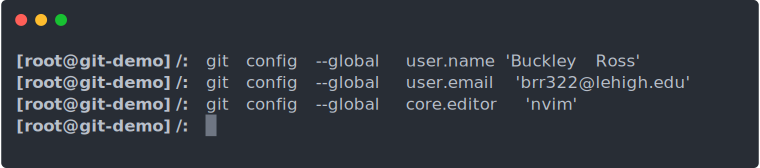

In the snippet above, you can see how I would configure git for myself (Buckley Ross).
Obviously, you should change the name and email to your own, since you are not me.
Note that you only need to do this once;
once you set these configuration settings with the `--global` option,
git will remember them for all of your future projects.

It's important to note that I set "core.editor" to 'nvim'
because I prefer to use [NeoVim](https://neovim.io) as my text editor (as you will see later on).
If you aren't familiar with NeoVim, you might want to use [VS Code](https://code.visualstudio.com) instead.
Once you've installed VS Code, just run `git config --global core.editor 'code'` to inform Git of your decision.
On Windows, you could even choose to use `notepad.exe` to edit files
by running `git config --global core.editor 'C:\Windows\System32\notepad.exe'`.
It's up to you to choose a text editor that you're comfortable with,
but don't worry too much about it, since you can always change your mind later.

## Your First Project

Now that we've personalized Git a little bit, let's try it out by creating a new project:


You can see in the above snippet that we created a new folder called *myProject*,
which is going to contain all of our code.
We then ran the `git init` command, which created a little folder called *.git*.
This *.git* folder is where git is going to store all of the data about your project,
including all of your backups, and all of the different versions of the code you'll create later on.

### Let's Add Some Content

Git works well with pretty much any kind of data that can be stored in a text file.
We're going to be using Python in this example because it's pretty easy to read,
but it's important to note that git doesn't care at all about your choice of programming language.

Let's create a new file inside our *myProject* folder, and call it *first.py*:
```python
def main():
	print('Hello, git!')

main()
```

This is a pretty good start to our project!
Once you've laid out the main file and entrypoint of your program like we have here (even if it doesn't do very much yet)
that means that it's time to make your first backup, or "commit" as git calls them.

### Checking in with Git

Before we can backup our project, we need to make sure that git knows which files we need it to backup,
and which ones it should leave alone.
To see what git is going to backup, we need to run the `git status` command.
The `git status` command asks git to summarize everything that's currently going on in our project,
as well as what needs to be done before we can make a new backup.
Whenever you're feeling unsure about exactly what's going on in your project,
always make sure to run `git status` to help you figure that out:

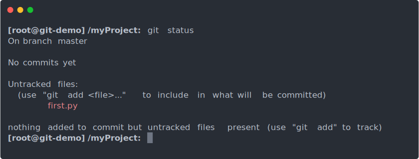

As you can see, git has found our *first.py* file, and has listed it as "Untracked",
which means that git isn't planning on backing up *first.py* because we haven't told git what to do with it yet.
This is a problem for us because we do want git to backup that file.
We can use the `git add <files>` command to tell git which files we want it to backup.
To add our *first.py* file, just run `git add first.py`.
Once you've added *first.py*, go ahead and run `git status` again to see what git thinks about that file now that we've added it.

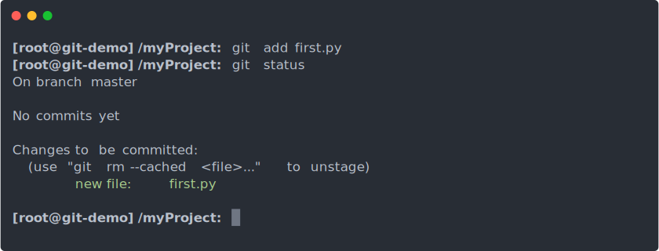

Note that our *first.py* file has been moved out of the "Untracked" section,
and is now in the "Changes to be committed" section.
This signifies that our file has been "staged", meaning that git has made a copy of it,
and is waiting for us to instruct it to save that copy as a proper backup.

## Your First Backup

Now that we've told git which files we want it to save, let's go ahead and make our first "commit", or backup of our project.
We can do this with the command `git commit`.
Once you run that command, git will automatically open the text editor you specified in the first part of this guide,
and prompt you to type a short message to describe your progress.
Once you've written a short, one-line title for your commit (you can also optionally add a more detailed description below the title),
you can finalize the commit by saving and closing the file with your commit message.


Congratulations! You've just made your first commit!

As you can see in the animation above, running `git status` after committing our code doesn't list any files,
and instead tells us that there is "nothing to commit".
This is because our most recent commit is completely up-to-date with all of the contents of our project,
so there is no reason for us to make another backup yet.

### Where did our Commit Go?

Commits like the one we just made get stored away inside git's internal database for safe keeping.
If you want to take a look at all of the commits we've made so far (which is just one commit, in the case of this example so far),
then you can use the `git log` command to get a comprehensive list of all of them:

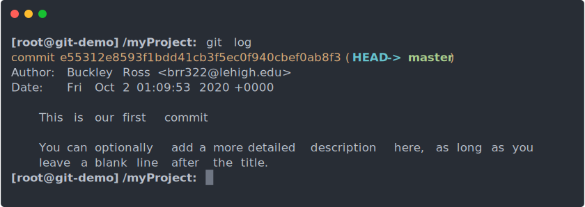

You can tell a lot about a commit just by looking at a log entry like this.
For starters, you can see the title and message we wrote earlier, along with the author and the date on which the commit was made.
Additionally, you can see that big hexadecimal number at the very top that starts with "e55312e8...",
along with the words "HEAD" and "master".
That number is called the "commit hash", and it's a unique number which can be used to identify this commit.
It's a pretty long number, so we'll often use a "short hash", which is the same number, but just the first 8 digits.
For example, the short hash of our commit here is just "e55312e8" (although if you're following along, yours is probably different).

"HEAD", "master", and the commit hash will all come in handy later when we talk about recovering data from past commits.

## Making Some Changes

Now that we've made our first backup, we can start making even more progress on our project.
Normally, you'd want to get a good bit of work done between now and your next commit,
but since this is just an example, and we're not really trying to accomplish anything with this python program,
I'm going to try to keep things as simple as possible.

Go ahead and update `first.py` to make it look like this:

```python
import random

def main():
	myNum = random.randint(0, 9)
	print('Here is a random number: {0}'.format(myNum))

main()
```

While we're at it, let's add a file called *README.md* inside of our *myProject* folder.
*README.md* is a file that often appears in projects, which contains useful information about the project.
Go ahead and put the following content into your *README.md* file:

```markdown
# My First Git Repository

Learning how to code, without worrying about losing our progress.
```

Now we've made some changes to our project.
Our main program prints a random number instead of just saying "Hello, git!",
and we also added a really short project description.
This is technically an improvement, although not a very significant one,
but even though it may only be a small change, git still takes notice:

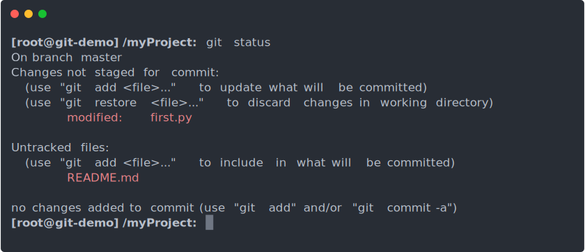

Now you can see that git has spotted the fact that we added a *README.md* file.
It also noticed that *first.py* has changed since our last backup,
which is why it is now listed under "Changes not staged for commit".
Before we commit, let's review the changes we made since our last commit.
Git makes this super easy with the `git diff` command:

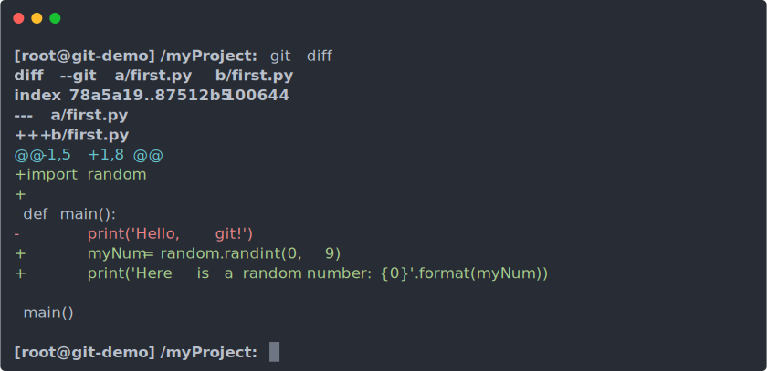

This command prints "diff" data, similar to the `diff` command on macOS and *nix platforms.
In short, all of the green lines which start with a "+" represent code that we've added since the last commit,
and all of the red lines which start with a "-" represent code that we removed.
This particular diff describes all of the changes we made to the *first.py* file since the last commit.
Normally, it would also show the changes we made to the *README.md* file,
but it ignored that file this time because we haven't committed *README.md* yet.

### Adding Another Commit

Now that we've reviewed our changes, let's go ahead and make another commit.
First, we need to add both of our files with the `git add` command, like `git add first.py README.md`.
Then, we'll need to run `git commit` again.
This time, we'll pass the `-m` flag to `git commit`, which allows us to specify a commit title without opening our text editor.

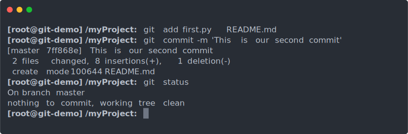

Great! We've made our second commit. Now, let's run `git log` again, and take a look at our updated commit timeline:

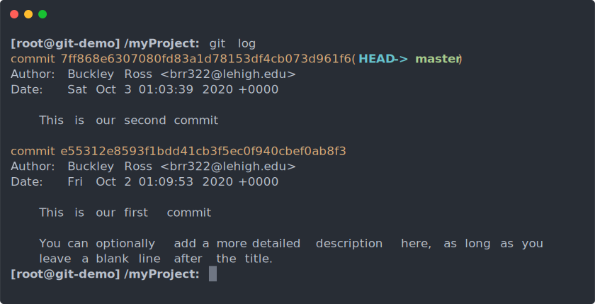

Now you can see the timeline and summary info of both of our commits so far!
Having backups like this is very nice and all,
but it's about time that we learned how to use these commits to recover our past data.

## Recovering Old Code

Before we can access our backups, we need to learn what "HEAD" and "master" mean when looking at the commit log above.
In short, "HEAD" is git's equivalent of a "YOU ARE HERE" sign.
It points to the current commit, which is to say,
the commit that we are currently building code on top of inside our *myProject* folder.
"master", meanwhile, refers to the most recent commit we have made to our current project branch.

This distinction will become more important in a moment, but for now,
let's see if we can get a peek at our old *first.py* file.
As usual, git has a helpful command for us.
This time, it's called `git show`, and it lets us view older files by specifying a commit and a filename.
Let's try it out with `git show HEAD:first.py`:

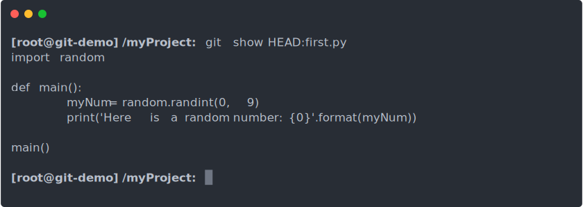

That's kind of cool, except not what we were trying to do.
We wanted to see the version of *first.py* we made in our first commit,
but instead it showed us the version we made at our second commit.
This is because "HEAD" got moved forward to our second commit when we committed earlier,
so we're going to need to change our `git show` command in order to see the original *first.py* file.

Fortunately, this is pretty easy.
When working with commit references like "HEAD", git lets us use a special symbol "~"
in order to indicate that we really want the commit before "HEAD".
Let's try that out now: `git show HEAD~:first.py`

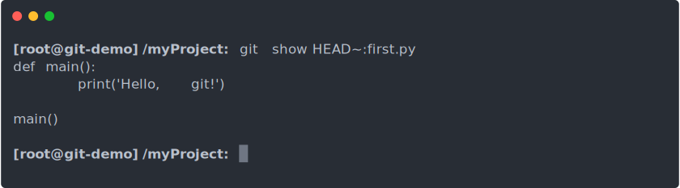

Perfect! There's our original *first.py* file, just like we wanted.

The "~" symbol can also be used more than once, so "HEAD~~" and "HEAD~~~" mean to go back 2 and 3 commits respectively.
There's even a numeric shorthand you can use, letting you specify "HEAD~2" or "HEAD~3" instead of "HEAD~~" or "HEAD~~~".

It's also worth mentioning that there's nothing particularly special about our use of "HEAD" here as our starting point.
We could have also used `git show master~:first.py` or we could have used a short hash like `git show e55312e8:first.py`,
or even `git show 7ff868e6~:first.py` and those would have all done exactly the same thing as `git show HEAD~:first.py`.

### Going Back in Time

`git show` is useful if you're just looking around a little bit, but sometimes you just need to take a full step backward
and look aroud for yourself.
The best way to do this is to move our "HEAD" (and thus our working copy of our code) away from our most recent commit,
and attach it to our original commit.
This time, the command to save us is called `git checkout`, and it's purpose is to allow you to move "HEAD" backward and forward
through your commit timeline.

In order to move through time, it's very important to make sure that everything you've done up until this point has been committed.
We can double check this by running `git status`, followed by `git add` and `git commit` if necessary.
In our case, `git status` doesn't show anything, meaning that we're ready to proceed with the checkout.
Let's use `git checkout HEAD~` to move "HEAD" back one commit:

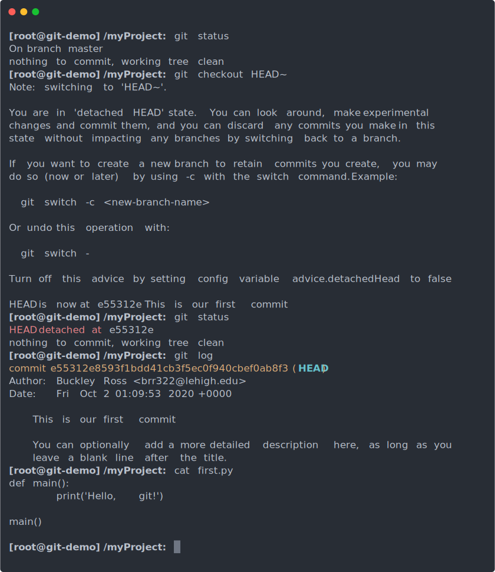

Wow, that was a lot of information!
To summarize, git is warning us that we've just entered what's called a "detached HEAD state".
This sounds kind of gruesome, but it's actually both completely safe and incredibly useful.
In this case, as you can see by the output of both `git log`, and `cat first.py` above,
we've successfully traveled back in time to our first backup, where all we had was a tiny "Hello, git!" program!

This is useful if you need to view code from the past,
but you can't really make any progress here without creating a diverging timeline
(something we'll talk about in *Git Intermediate*).
For now, let's just try to get back to the present.
As I said before, `git checkout` can be used for both forward and backward navigation through your commit log/timeline.
Since we were previously working at the commit labeled "master", getting back to the present is as easy as `git checkout master`:

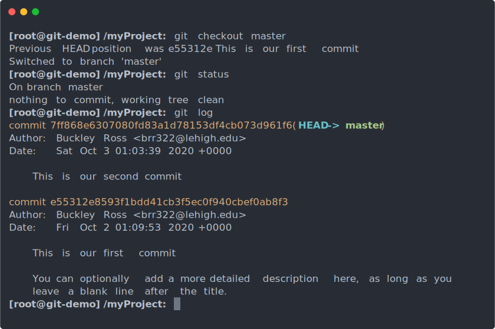

At last! We've made it back to the future! (or at least back to the present)

Things are definitely better here,
but it might have been nice if we could have brought that older version of *first.py* back here with us.
Fortunately, `git checkout` can help us to do just that!
If, instead of just specifying `git checkout <commit>`, we also provided a list of files,
like `git checkout <commit> -- <files>`, then `git checkout` would be able to bring those files back from the specified commit,
and into our working directory:

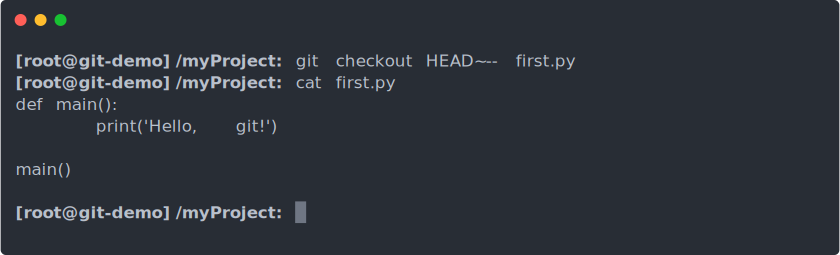

Yes, that's much better, isn't it?
Let's finish this off for now with one last `git commit`, shall we?


That's all for now. Make sure to checkout our next guide, *Git Intermediate*,
to learn how to publish your projects online, and how to code as a team with your friends!

