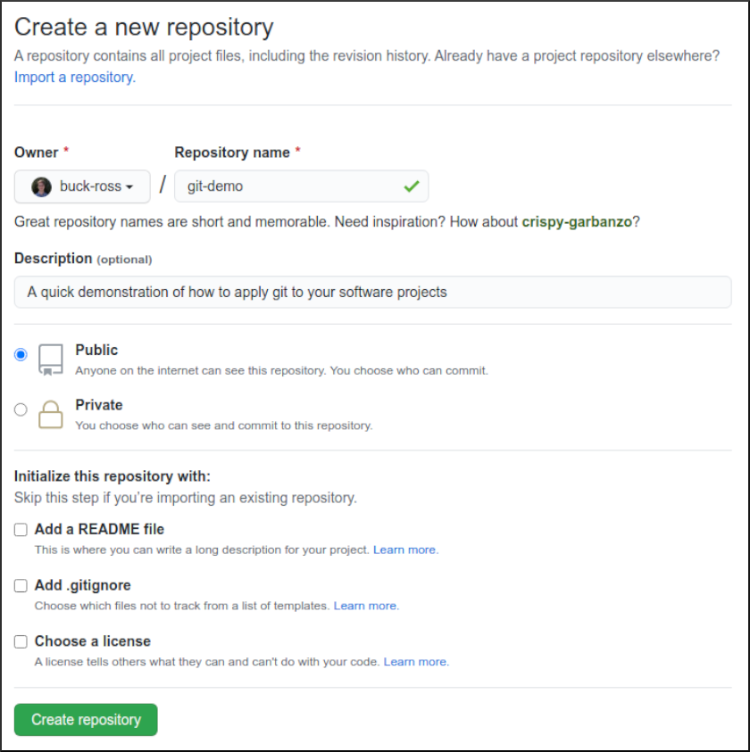
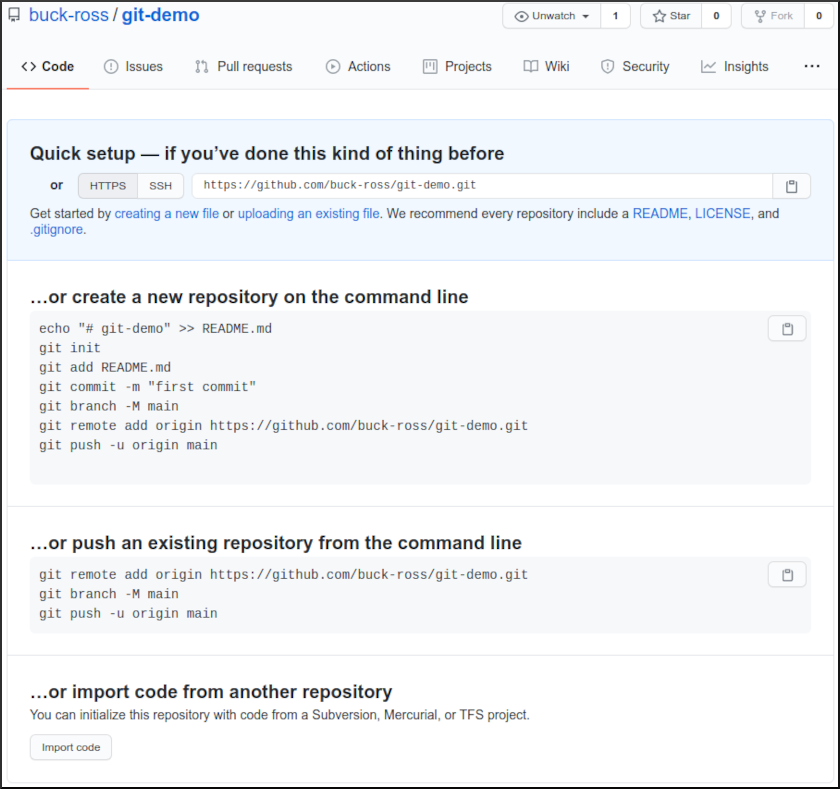

# Git: Intermediate

Welcome back!
Last time, we learned how to use git to commit (or backup) our code incrementally,
as well as how to navigate forward and backward through our git timeline in order to retrieve information from those commits.
In this article, we're going to learn how to move sideways through time, or to put it more simply,
how to develop multiple different versions of our project in parallel.
The main reason it is useful to do this is so that you and your teammates can each work on different parts of your program at the same time,
without needing to worry too much about what everyone else is doing.

## Sharing your Code Online

The first step to working on a team project is to decide how you're going to share your code with each other.
There are lots of great websites out there designed to help you do just that,
including [Bitbucket](https://bitbucket.org/), [GitLab](https://bitbucket.org/),
or you could even make your own website with [GitWeb](https://git-scm.com/book/pl/v2/Git-on-the-Server-GitWeb),
but the most popular choice today is [GitHub](https://github.com/).
We'll use GitHub for the scope of this guide, but everything we're going to cover here can be applies to all of the alternatives listed above.

To start things off, you're going to need to create an account on GitHub. Follow [this link](https://github.com/join) to create your account.
Once you've created your account, you can click the "new repository" button
(or just follow [this link](https://github.com/new)) to create a new project on GitHub.
You're going to have to include some basic info here, like the name of your project, and an optional description.
You can put whatever you want here, but I'm going to call mine *git-demo*:

After you click the big green "Create repository" button, GitHub will create a new repository
where you and your teammates can work together on your project:

## Where to Next?

- [Next: Git Advanced](./1c.%20Git%20Advnaced.md)
- [Previous: Git Basics](./1a.%20Git%20Basics.md)
- [Top: README](../README.md)

