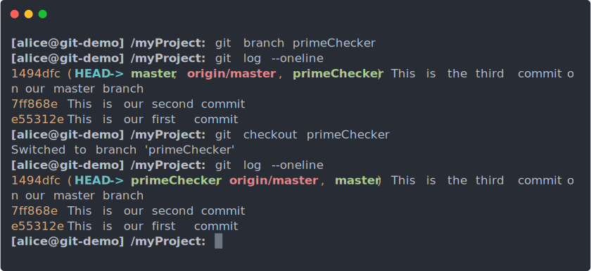

# Git: Intermediate

Welcome back!
Last time, we learned how to use git to commit (or backup) our code incrementally,
as well as how to navigate forward and backward through our git timeline in order to retrieve information from those commits.
In this article, we're going to learn how to move sideways through time, or to put it more simply,
how to develop multiple different versions of our project in parallel.
The main reason it is useful to do this is so that you and your teammates can each work on different parts of your program at the same time,
without needing to worry too much about what everyone else is doing.

## Sharing your Code Online

The first step to working on a team project is to decide how you're going to share your code with each other.
There are lots of great websites out there designed to help you do just that,
including [Bitbucket](https://bitbucket.org/), [GitLab](https://bitbucket.org/),
or you could even make your own website with [GitWeb](https://git-scm.com/book/pl/v2/Git-on-the-Server-GitWeb),
but the most popular choice today is [GitHub](https://github.com/).
We'll use GitHub for the scope of this guide, but everything we're going to cover here can be applies to all of the alternatives listed above.

To start things off, you're going to need to create an account on GitHub. Follow [this link](https://github.com/join) to create your account.
Once you've created your account, you can click the "new repository" button
(or just follow [this link](https://github.com/new)) to create a new project on GitHub.
You're going to have to include some basic info here, like the name of your project, and an optional description.
You can put whatever you want here, but I'm going to call mine *git-demo*:


After you click the big green "Create repository" button, GitHub will create a new repository
where you and your teammates can work together on your project:


### Downloading our Repository

Great! We now have an online repository to store all of the code for our project.
Let's get things started by downloading it so we can use it on our local computer.
In order to do this we first need to copy the link under the "Quick setup" section on our project's GitHub page.
My link is "https://github.com/buck-ross/git-demo.git", but yours will be something different,
depending on your username and the name you chose for your project.

Once we have the link copied, we can pass it as an argument to `git clone`.
`git clone` is kind of like `git init` from the last guide, except instead of creating a new project,
it lets us download an existing one from the internet:


### Uploading our Repository

This is nice, but the project's repository is still totally empty.
Let's fix this by uploading our project code from the last guide.
In order to tell git where to upload our code, we need to create a new "remote".
A "remote" is just a URL that git associates with a name, so that it can remember where you like to share the code for your project.
When you `git clone` a repository, git automatically creates a new remote called "origin",
and associates it with the repository you cloned from.

We can replicate this "origin" remote for our other project's folder by running `git remote add origin`, and giving it the URL for our repository:


Once we have setup the new remote, we can now upload our code to the repository on GitHub.
To do this, git provides the `git push` command, which we can use like so:


Note that `git push` might prompt you for some login info here.
That's pretty normal.
Just type in your GitHub username & password, hit *[ENTER]*, and you should be good to go.

Although you can normally just run `git push` by itself, without any arguments, and it will just handle the upload for you,
we had to add the `--set-upstream origin master` this time because "master" is a new branch we created in the last guide
when we made our first commit, and GitHub doesn't know about "master" yet, so we use this flag to tell GitHub about our new branch.

You can also see that the `git status` line we ran provided an extra line of output, saying "Your branch is up to date with 'origin/master'".
This means that our upload was successful, and that the latest copy of our code has now been uploaded to GitHub!
Let's go back to our repository's page on GitHub, and refresh the page to see if it updated.


Excellent! It looks like everything from both our *README.md* and *first.py* files made it to GitHub!
Now all of your friends/teammates can download your code by running `git clone`, just like we did earlier.

Speaking of `git clone`, let's go back over to the other copy of our project that we cloned earlier in this guide.


Now that we're back, it looks like none of the changes we uploaded earlier got transferred over to our cloned copy.
This is because, although we succeeded in uploading our project to GitHub, this copy of the project was cloned before we did that,
so the copy we cloned was not up to date with the copy we later pushed.

### Updating our Cloned Repository

To resolve this, we need to update our local copy of the project to reflect the changes to the copy on GitHub.
To do this, git provides the command `git pull` (it's kind of like `git push`, except we're downloading from GitHub instead of uploading):


As you can see from the output of `git log` (made more succinct, thanks to `--oneline`),
our cloned copy has now been updated to reflect all three of the commits we pushed from our project earlier.

There is also a new branch listed, called "origin/master".
As you might have guessed from the name, "origin/master" represents the current state of the "master" branch on GitHub
(remember that GitHub is our "origin" remote).
If you decide to add another commit to your local copy of master, your master branch will advance by one commit,
but you'll need to run `git push` in order to bring origin/master up to date with your local branch.

## Collaborative Coding with Git

The hardest part of software development isn't working with software - it's working with other people.
In fact, that's pretty true of most things in life.
People often work at different paces, some people may prefer to work more independently than others,
and in some situations, people may even live in geographically distant parts of the world, making communication difficult to say the least.
These are extremely important things to consider when you're trying to work together with any group of people
(regardless of what your end goal is - software related or not).

Fortunately, git and GitHub enable us to combine the best parts of working together as a team with the best parts of working independently,
through a process called "the branching workflow".
This works by splitting the commit timeline into multiple, parallel timelines (called "branches").
Once you create a new branch, you are free to work on that branch completely on your own,
without needing to worry about what everyone else on your team is doing.
Then, once you finish your work on that branch, you can merge your code back into the main branch,
where it can be integrated with the rest of the project.

### Introducing Alice and Bob

In order to demonstrate how the branching workflow works, I'm going to elicit the help of everybody's favorite fictional programmers: Alice and Bob!
They're going to be continuing things where we left off with our little Python project from last time,
but this time they're going to be working on it together, as a team.

To keep things simple, we're going to be giving Alice and Bob two tasks, so that they can easily divide up the work evenly between them.
The tasks themselves don't really matter too much for the sake of this example, so we'll try to keep them simple:

1. Write an algorithm to check whether a number is prime or not.
2. Write an algorithm to compute the nth number in the Fibonacci sequence.

There! Not too hard, but not unrealistically easy either.
Let's see how Alice and Bob handle their new assignment.

### A Job for Alice!

After talking it over with Bob, they both agreed that Alice would tackle the prime number algorithm, while Bob does the Fibonacci one.

Before Alice can start coding, however, she needs to create her own isolated commit timeline ("branch"),
so that her work on the prime number checker doesn't interfere with Bob's work, and vice versa.
Alice can do this by running the `git branch` command, along with a name for her new branch.
Let's call this branch "primeChecker":



As you can see, `git branch` created our new branch, but it didn't update our `HEAD` to be on the new branch.
This is why we had to run `git checkout primeChecker` to move our `HEAD` to the new `primeChecker` branch.

It's also worth mentioning that Alice still hasn't told GitHub about her new branch
(which is why there is no "origin/primeChecker" branch in our `git log` output).
Let's do this now, using `git push`:


### Coding the Prime Number Checker

The code that Alice needs to add here is pretty straight forward, which is good because I'm not going to explain it to you
(again: it's not the code that matters here; it's the process).
Start by creating a new file in the same directory as our *first.py* file.
Let's call this new file *primeChecker.py*:

```python
import math

def checkPrime(n):
	for i in range(2, math.ceil(n/2)):
		if (n % i) == 0:
			return False
	return True
```

That's all the code Alice needs in order to check whether or not a given number `n` is prime.
It's probably not the most efficient algorithm, but seeing as this is a guide to Git, and not to Python, it's good enough for what we're doing.
Let's go ahead and commit it to our new "primeChecker" branch:


Before we finalize our new feature, let's add a little bit of code in our *first.py* file which makes use of this algorithm to test some numbers:

```python
from primeChecker import checkPrime

def main():
	print('43 is {}'.format('prime' if checkPrime(43) else 'not prime'))
	print('55 is {}'.format('prime' if checkPrime(55) else 'not prime'))

main()
```

Testing our code above with the command `python ./first.py` should yield the following output:

> 43 is prime\
> 55 is not prime

Once you've verified that everything is working correctly, it's time for Alice to make one last commit
before we integrate our feature with the master branch:


As you can see by the above animation, `git status` tells us that our "primeChecker" branch is now 2 commits ahead of the copy on GitHub.
Let's have a look at our commit log for a bit more detail:


Note the use of the `-3` argument to `git log` to limit the length of the log to just the three most recent commit.
I also used `--abbrev-commit` here to make `git log` print short hashes, instead of the long ones.

So, after the past 2 commits, we've managed to advance the timeline of our local "primeChecker" branch,
but the remote "primeChecker" and local "master" branches are lagging behind our progress.

We're going to go ahead let Alice take a break for a little while,
but first she should make sure to push her branch to GitHub, so that all of here work is backed up to GitHub's cloud:


Note here that we're finally able to use `git push` without any of that `--set-upstream` nonsense.
This is going to become the norm from now on, since we've already created all but one of the branches we'll be using in this guide.

## A Job for Bob!

Now it's time for Bob to contribute to our project by writing an algorithm to compute the nth term of the Fibonacci sequence.

Since we already cloned a copy of our repository earlier in the directory *git-demo*, why don't we let Bob do all of his work
inside of that folder, instead of the *myProject* folder, so he doesn't interfere with Alice's work.
Let's start things off by repeating the process Alice followed from `git branch` to `git push` to create a branch for Bob to work on:


Before we move on to actually implementing the two new features, it's worth revisiting the GitHub page for just a moment.
Note how by clicking on the button that says "master", you can now see that GitHub is now aware of all of the other branches we are working on:


You can click on each of these new branches to view the code for that version.
They're all the same right now, because we haven't done any work on the implementation of each new feature.
Let's fix that now.

## Coding the Fibonacci Sequence Algorithm

Like with Alice, we're going to try to keep things simple(ish) here.
Here's the code for the Fibonacci sequence algorithm.
You should put it in a file called *fibonacci.py*, in the same directory as *first.py*:

```python
def nthTerm(n):
	values = [1, 1]
	while n > 2:
		tmp = values[1]
		values[1] += values[0]
		values[0] = tmp
		n -= 1
	return values[1]
```

And again, let's make a few modifications to `first.py`, making use of our new feature:

```python
import fibonacci

def main():
	print('The 10th term in the fibonacci sequence is {}'.format(fibonacci.nthTerm(10)))
	print('The 50th term in the fibonacci sequence is {}'.format(fibonacci.nthTerm(50)))

main()
```

This time, testing with `python ./first.py` should produce the following output:

> The 10th term in the fibonacci sequence is 55\
> The 50th term in the fibonacci sequence is 12586269025

You probably noticed while editing *first.py* that Bob's branch is missing all of the code that Alice added.
This is going to pose a bit of a problem later, which is why as a general rule of thumb,
you should always avoid any situation where two people have to make edits to the same file at the same time on different branches.
This is yet another reason you should always strive to write modular code.
At any rate, that's not a problem that we need to worry about just yet.

## Creating a Pull Request

While Bob is finishing up his code, Alice has returned from her break, and since she has already written all of her code,
it's time for her to integrate her code into the master branch of the project (merging into master is analogous to turning in an assignment).

If we return to GitHub and refresh the page, we'll see a new button appear at the top of our screen:


Clicking on the new "Compare & pull request" button will allow us to create a "Pull Request" (or "PR" for short).
Pull Requests allow us to merge the two timelines of our "master" branch and our "primeChecker" branch together,
so that people who try to use the code we have in the "master" branch will be able to use the new feature we finalized in our "primeChecker" branch.

Go ahead and click on the "Compare and pull request" button so we can merge our branch into "master".


On this screen, GitHub is asking us to provide a little more information about the nature of our request.
Specifically, it want's us to provide a short description of the changes we included in our feature branch.
Most big projects will provide you with a template to fill out here, or give you some guidelines on the sort of information
the developers want you to provide here,
but for the purposes of our little project here, just one or two sentences should cover this feature.

Additionally, you'll notice near the top of the page that there is a green check mark, with the words "Able to merge" written next to it.
This is important because it tells us that all we will need to do in order to merge our changes into master is to click a button.
If this wasn't there (which we'll see later on in this guide), then we would need to manually edit some files in order to make the Pull Request
work.

Let's move things along by clicking the "Create pull request" button:


This is your First Pull Request in all its glory!
If you copy the URL in your browser's address bar (mine is "https://github.com/buck-ross/git-demo/pull/1"),
you can share this page with your teammates, and they can review your code & leave comments on what they think of your work so far.
You can even make more commits & push them to your working branch, and they will show up here as part of the PR.
This can be a fantastic (and super easy to use) tool for conducting and documenting code reviews all at once
(and without the added hassle of needing to do a write-up for your code-review; just use your conversation in the comments of the PR)!

### Finalizing the Merge

Once Alice has done her code review, and she finally feels like her feature is ready to be merged into the "master" branch,
all she needs to do is to press that little green "Merge pull request" button in the middle of that last screenshot
(And then also click on the "Confirm merge" button that appears after you click "Merge pull request"),
and all of her changes will go straight into the "master" branch where they belong:


Excellent! Now Alice's work has been merged into the master branch:


## The Dreaded Merge Conflict

While Alice enjoys the satisfaction of having merged her PR into the master branch,
Bob is just finishing up his branch by committing his code and pushing it to GitHub:


With his code committed & pushed to GitHub, Bob tries to follow the same steps Alice did when she created her Pull Request,
but he finds himself facing a slightly different, and somewhat unsettling screen:


Take note of the little "Can't automatically merge" notice at the top of Bob's screen here.
Sure enough, when Bob clicks on "Create pull request", he finds that he is unable to merge his branch by pushing the "Merge pull request" button
the way Alice did:


This is all because of the issue I mentioned earlier about how Bob and Alice should not have both been messing around with *first.py*.
This creates a situation called a "merge conflict", meaning that both branches involved in the merge have made edits to the same file,
and git doesn't know how to resolve those conflicting versions of that file.

This may seem kind of scary (especially if you haven't seen it before in a guide like this one),
but although merge conflicts are very annoying, they aren't too difficult to resolve if you know what you're doing.

## Where to Next?

- [Next: Git Advanced](./1c.%20Git%20Advnaced.md)
- [Previous: Git Basics](./1a.%20Git%20Basics.md)
- [Top: README](../README.md)

