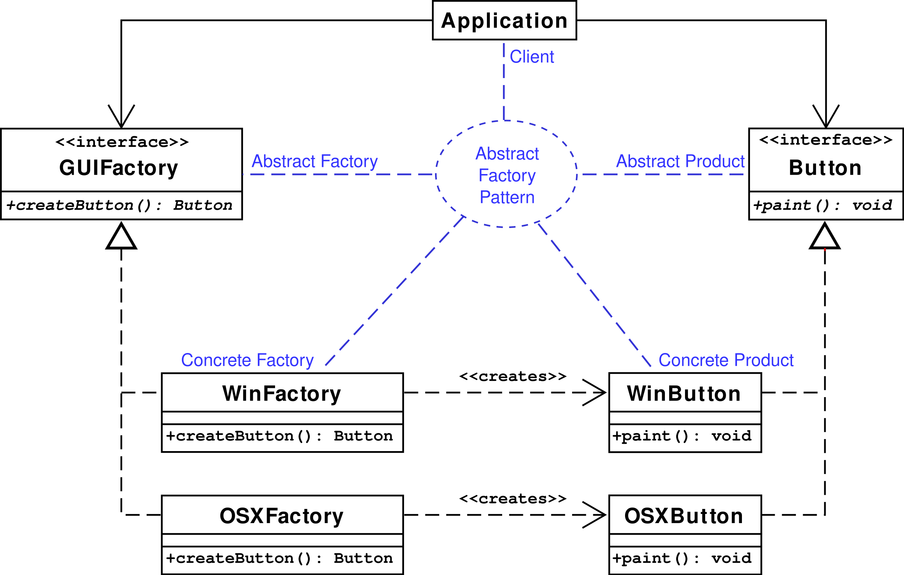
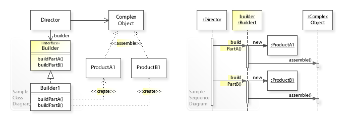

# Creational Software Design Patterns

## Abstract Factory Pattern:
This pattern is all about **providing an interface for creating families of related or depedendent objects, without specifying their concrete classes**

A diagram of how this works can be found below:

Visit [this link](https://en.wikipedia.org/wiki/Abstract_factory_pattern#Python_example) for a code sample describing the above diagram.

## Builder Pattern:
This pattern is used to **separate the construction of a complex object from its representation.** This allows the same construction process to create different representations of an object.

This can be seen in the following diagram:

## Factory Pattern
This pattern is about **defining an interface for creating an object, but lets subclasses decide which concrete class to actually instantiate.** 

Object creation can lead to significant duplication of code, require information that is not acessible to the composing object, or deal with information that does not really concern the composing object.

An example of how this could be:

Given a class `Vehicle` that has a member `Motor` of interface `IMotor`, but **no concrete type of `Motor` defined in advance.**

This `Motor` can either be constructed by telling the `Vehicle` constructor to use an `ElectricMotor` or a `GasolineMotor`.

The `Vehicle` constructor code then calls a `Motor` factory method, to create the desired `Motor` that complies with the `IMotor` interface.