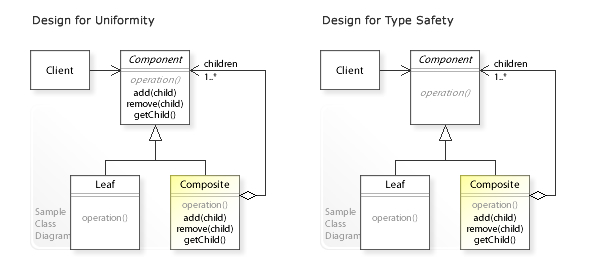

# Structural Software Design Patterns

## Adapter Pattern:
As the name implies, the adapter pattern (also formally known as the Wrapper Pattern) allows the interface of an existing class to be used as a different interface.

Now in English, this means the pattern is often used to **make existing classes work with others without modifying the source code.**

Below is the UML Diagram for this pattern:

Visit [this link](https://en.wikipedia.org/wiki/Adapter_pattern#Java) for a Java Implementation that describes the pattern better.

## Composite Pattern:
This pattern is really important when working with **Tree-structured data.** This is because programmers typically need to perform different actions when encountering a leaf node versus a branch in the tree. This can get complicated quickly, considering the variability of what a leaf node could be and what the linkage is between nodes.

The Composite Pattern allows programmers to deal with Parts (leaves) and Composite (whole brances) as one, greatly simplifying the problem.

Below is the UML Diagram for this pattern:

Visit [this link](https://en.wikipedia.org/wiki/Composite_pattern#Java) for a Java Implementation of this kind of pattern.

# More information on Structural Patterns
If you would like to learn more about the different kinds of Structural Patterns, you can start with this list:

[Structural Patterns](https://en.wikipedia.org/wiki/Software_design_pattern#Structural_patterns)

## Where to Next?
- [Next: Behavioral Patterns](./7e.%20Behavioral%20Patterns.md)
- [Back: Creational Patterns](./7c.%20Creational%20Patterns.md)
- [TOP: CSE6cubed](../README.md)