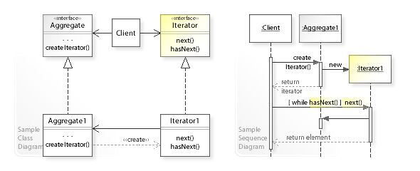

# Behavioral Software Design Patterns

## Iterator Design Pattern:
This design pattern is very useful because it **provides a way to access the elements of an aggregate object sequentially without exposing its underlying data structures/representation.**

This allows for algorithms to be independent of the container-type they are traversing since the Iterator implements the logic to provide sequential elements.

Below is the UML Diagram for this pattern:

## Observer Design Pattern:
This pattern is mainly used to implement a form of **distributed event handling system in an "event driven" application.** One object acts as the subject, which maintains a list of "observers", and notifies all observers of any state changes.

Below is the UML Diagram for this pattern:

An example implementation in Java of the Observer Pattern can be [found here](https://en.wikipedia.org/wiki/Observer_pattern#Java)

# More information on Behavioral Patterns
If you would like to learn more about the different kinds of Behavioral Patterns, you can start with this list:

[Behavioral Patterns](https://en.wikipedia.org/wiki/Software_design_pattern#Behavioral_patterns)

## Where to Next?
- [Next: Concurrency Patterns](./7f.%20Concurrency%20Patterns.md)
- [Back: Structural Patterns](./7d.%20Structural%20Patterns.md)
- [TOP: CSE6cubed](../README.md)